<!DOCTYPE html>
<html>
<head>   
      <h1>БДЮТ - Будинок дитячої та юнацької творчості Христинівської міської ради Черкаської області</h1> 
      

            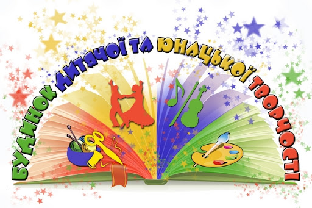
            
        

</head>
<body>
    <header>
    <section id="animationSection">
        <h2>БДЮТ - це місце де ваша дитина знайде своє захоплення. Зустріне справжніх друзів та однодумців. З користю буде проводити час та розвиватися</h2>
       
У нашому будинку творчості ваші діти завжди зможуть відкривати нові можливості, розвивватися та надихатися на великі звершення. 
         Вонии тут завжди будуть знаходитися під наглядом наших крутих спеціалістів, які в свою чергу будуть пікулватися про них та навчатимуть новому. 
         Наші викладачі першокласні спеціалісти своєї справи, які будть передавати вашим дітям свої знання з різних напрямків, таких як: музика, хореографія,анімація, тетр, рукоділля, малювання та багато іншого. 
         Відвідуючи наш будинок наші вихованці не одноразово беруть участь в безліч найрізноманітніших концертах, виставах, змаганнях та конкурсах, на яких займають призові місця. 
         У нашому закладі функіонують безліч гуртків: 
<a href="#section1">Гурток "Оригамі"</a>,
<a href="#section2">Гурток "Хенд-мейт"</a>,
<a href="#section3">Ляльковий театр</a>,
<a href="#section4">Гурток «Анімація»</a>,
<a href="#section5">Світ танцю</a>,
<a href="#section6">Гурток «Пізнаємо рідний край»</a>,
<a href="#section7">Декоративно – ужиткове  мистецтво</a>,
<a href="#section8">Спортивний туризм</a>,
<a href="#section9">Країна чарівного мистецтва</a>,
<a href="#section10">Юні флористи</a>,
<a href="#section11">Геометричне моделювання</a>, 
<a href="#section12">Гурток з робототехніки "Лего"</a> та
<a href="#section13">Англійська мова - крок за кроком</a>.
        Тож ласкаво просимо до нас, у нашу велику творчу родину!
       

        

    <section id="textSections">
        <h2>Наші гуртки для ваших дітей </h2>
        <ul>
</li><h1>
Гурток "Оригамі"
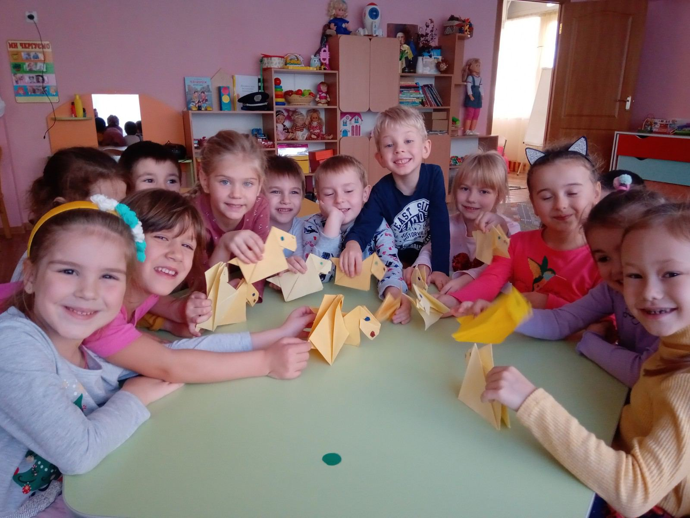</h1>  Головна мета гуртка «Оригамі» - розвиток творчих здібностей гуртківців шляхом навчання мистецтва оригамі.
У процесі навчання у гуртках вирішуються такі завдання:
• закріплення та розширення знань, отриманих на уроках математики, малювання;
• формування вмінь оперувати знаково-символічними засобами;
• набуття знань про культури різних народів;
• розвиток мислення гуртківців;
• розвиток творчого мислення.
Оригамі — це мистецтво складання паперу, створення різноманітних фігурок і декоративних предметів із простого та доступного матеріалу - паперу. Залишаючись невід’ємною частиною японської культури, оригамі розповсюдилось у всьому світі, приносячи радість і користь мільйонам людей.
В Будинку дитячої та юнацької творчості гурток «Оригамі» розпочав свою роботу в 2007 року.
Проявляти своє винахідництво, фантазію, дати друге життя паперу, розвинути творчі здібності, сформувати естетичні смаки допомагає дітям гурток «Оригамі». Цей гурток користується великою популярністю серед дітей. Вихованці вчаться складати неповторні речі з паперу, які надзвичайно привабливі. Із простих фігурок створюють цікаві композиції. Крім того, на заняттях гуртка діти оволодівають технікою «квіллінг» та створюють об’ємні композиції та панно. Вироби дітей є результатом творчої, майже ювелірної роботи.
Свої вміння і навички вихованці демонструють на міських, обласних та Всеукраїнських виставках з технічної творчості «Мистецтво орігамі», обласному конкурсі «Майстри орігамі», де вони неодмінно стають переможцями.
<a href="#top">Вверх &uarr;</a>
</li>

   </li><h1>
Гурток "Хенд-мейт"
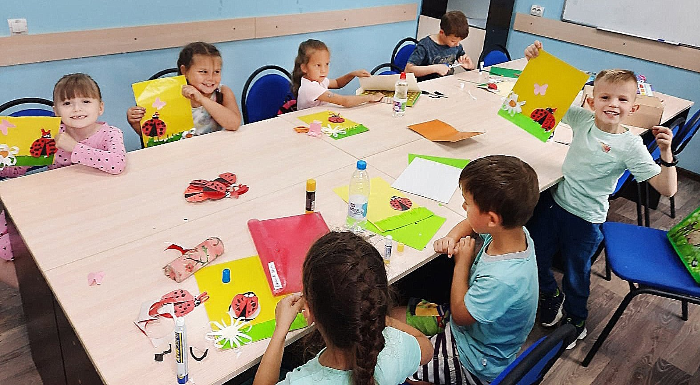 </h1> На заняттях діти крок за кроком вчаться втілювати дизайнерський задум, творчі ідеї. /Гармонійно поєднують естетичні і практичні якості у власних виробах. Опановують різні техніки декоративно-ужиткового мистецтва (аплікація, шиття, вишивка, макраме, батик, сіномотання та ін.). Вчаться їх поєднувати, використовуючи широку палітру природних і штучних матеріалів.
Здобуті знання, вміння і навички дозволяють створювати:
- аксесуари для гарного настрою;
-лайфхаки власними руками;
- розвиваючі іграшки та іграшки антистреси;
- подарунки, тематичні сувеніри (хендмей)
Крім того, займаючись діти оволодівають різноманітними стилями, техніками і технологіями дизайну та декору, вчаться використовувати різноманітні матеріали та інструменти, опановують нові не лише таємничі ремесла, а й знаходять нові оригінальні поєднання національних традицій з сучасним пластичним рішенням образу, що відповідає естетиці наших днів.
Хенд-Мейд –це вираження неординарної ідеї та таланту автора. Часто Хенд- Мейд речі народжуються тільки тому,що автор не може знайти те,що йому потрібно серед готових виробів запропонованих магазинами. Однак бажання виділитися з натовпу,носити щось яскраве,незвичайне,красиве , настільки сильне, що він створює таку річ своїми руками. Реалізуючи свою фантазію та оригінальні задуми. При спробі скопіювати таку річ іншою людиною - все одно не вийде двох ідентичних речей, тому що манера та техніка виконання у майстрів різні. Кожен виріб унікальний, як унікальна кожна людина.
<a href="#top">Вверх &uarr;</a>
</li>

   </li><h1>
Ляльковий театр
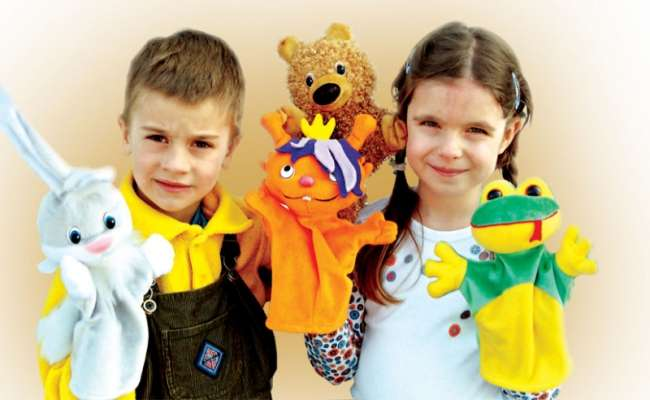 </h1> Ляльковий театр - це чарівний світ, де оживає дитяча фантазія!
Зустріч із казкою завжди є таємничою і неповторною. А доторкнутися до самої казки, створити її, показати, виконати роль персонажа – чи не є мрія кожної дитини.
Гурток «Ляльковий театр» розпочав свою роботу у 2005 році, у 2014році ляльковому театру «Добрик» було присвоєно звання Зразковий художній колектив.
Заняття у гуртку дають унікальну можливість пізнання світу: вчать мислити, бачити, чути, любити; сприяють духовному та гармонійному розвитку дітей, формують художній смак, ознайомлюють з кращими зразками народних, українських та авторських казок, знайомлять з елементами акторської майстерності, сценічних рухів, сценічної мови, вчаться розуміти театральне мистецтво, бути грамотними глядачами.
<a href="#top">Вверх &uarr;</a>
</li>

   </li><h1>
Гурток «Анімація»
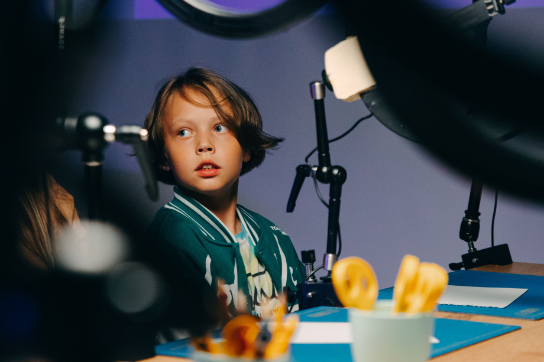 </h1> Під час занять гуртка діти можуть бути не лише глядачами, а й активними творцями мультиплікаційних фільмів. Вони пишуть сценарії, малюють і виготовляють з різноманітних матеріалів фігурки придуманих персонажів, оживляють та віддають часточку душі своїм творінням, знімають і озвучують мультиплікаційні фільми. Це прекрасний механізм для розвитку творчих здібностей дитини, а також можливість відтворити дитячий світ засобами анімації. Світ мультиплікації - це світ нашої уяви, світ, в якому сонце, місяць, зірки і всі живі речі підкоряються нашим наказам. Для мультиплікації немає нічого недоступного. Це мистецтво майже необмежених можливостей, де дійсність тісно переплітається з фантазією і вигадкою, де вони стають дійсністю.
<a href="#top">Вверх &uarr;</a>
</li>

   </li><h1>
Світ танцю
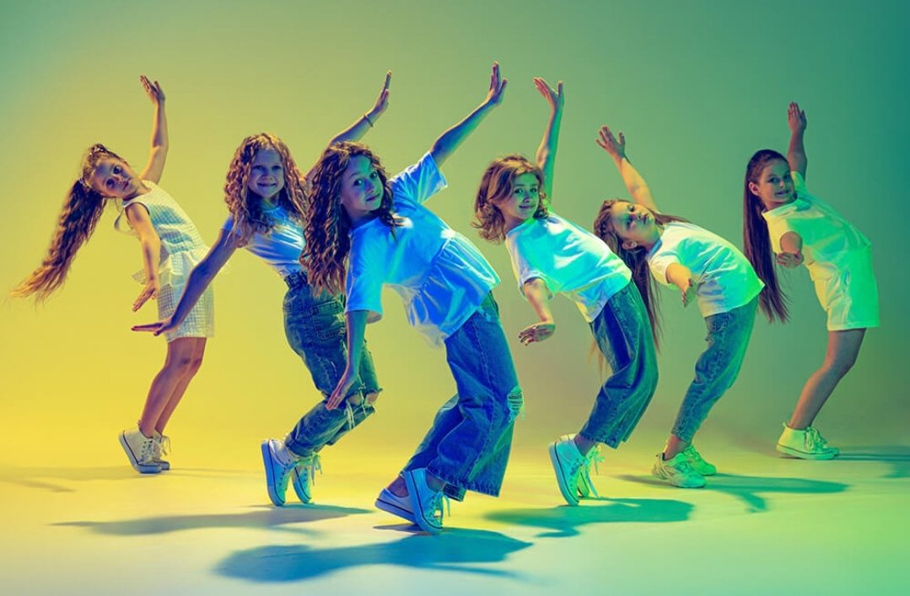 </h1> Танцювальне мистецтво є невичерпним джерелом збагачення особистості. Завдяки систематичній хореографічній освіті учні набувають не тільки професійних навичок, але й ряд необхідних якостей: почуття колективізму, працьовитості, зібраності, витримки, чуйності, доброти, патріотизму, національної гідності, інтересу до історії свого краю.
Танець є одним з найулюбленіших і доступних видів творчості, який являє собою синтез різних видів мистецтв: музичного, драматичного, пантоміми. Він вчить їх красі та виразності рухів, сприяє розвитку особистості. Заняття хореографією розвивають мислення і фантазію, вчать бачити, розуміти і створювати прекрасне, виховують пластичну культуру, зміцнюють організм дитини, формують правильну поставу, координацію рухів, допомагають виправленню деяких фізичних вад.
Більше 15 років працює хореографічний колектив «Фортуна» під керівництвом Брицької Оксани Василівни. Висока результативність навчальної діяльності визначається комплексністю освітнього процесу. А саме: поряд із вивченням основ класичного танцю, діти вивчають сучасний та народно-сценічний танець, що ефективно сприяє ґрунтовному засвоєнню базових спеціальних знань, розкриває індивідуальність творчого потенціалу вихованців та спрямовує їх на свідомий вибір майбутньої професії. В репертуарі колективу сучасні та естрадні хореографічні композиції, танці народів світу. Колектив «Фортуна» удостоєний безлічі нагород, Міжнародних і Всеукраїнських конкурсів і фестивалів, є постійним учасником концертних програм міста. Проявив себе як талановитий, професійний, організований колектив.
<a href="#top">Вверх &uarr;</a>
</li>

   </li><h1>
Гурток «Пізнаємо рідний край»
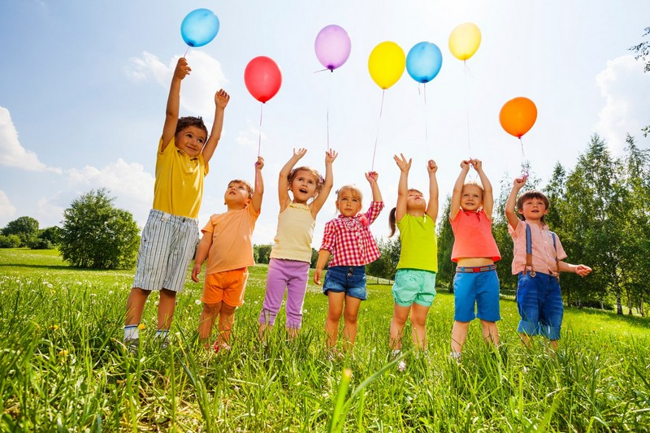 </h1> Під час занять гуртка вихованці знайомляться з різноманітністю флори і фауни, вивчають проблеми раціонального природокористування, отримують вміння працювати з різноманітним природним матеріалом. В гуртку використовуються різноманітні форми організації освітнього процесу: догляд за рослинами і тваринами живого куточку, проведення екскурсій в природу, по екологічній стежці, проведення фенологічних спостережень, виконання творчих робіт з природного матеріалу тощо. Заняття в гуртку сприяють формуванню у дітей екологічного світогляду, бережливого ставлення до природи.
<a href="#top">Вверх &uarr;</a>
</li>
   
   </li><h1>
Декоративно – ужиткове  мистецтво
 </h1> Вихованці працюють за початковим рівнем. Гуртківці ознайомлюються з різними видами декоративно-прикладної творчості, вивчають технології виготовлення виробів різними художніми техніками: бісероплетіння, вишивка, писанкарство, витинання; вивчають символи й орнаменти українського народу, ознайомлюються з творчістю народних майстрів та сучасними напрямами декоративно-ужиткового мистецтва. Характерною особливістю сучасного розвитку декоративно - ужиткового мистецтва є відродження народних традицій та пошук нових технік, а також поєднання різних технік, матеріалів. Саме цим займаються вихованці на заняттях гуртка.
<a href="#top">Вверх &uarr;</a>
</li>
   
   </li><h1>
Спортивний туризм
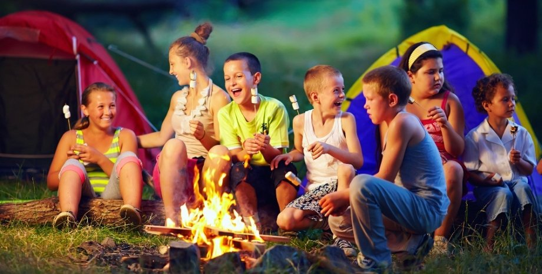 </h1> Туризм – цe вiдпoчинoк, який зaxoпить i зaцiкaвить дитину, нeзaлeжнo вiд йoгo вiку. Види туризму нacтiльки рiзнoмaнiтнi, щo рoзвaгу дo душi змoжe знaйти i любитeль руxливиx iгoр, i юний дocлiдник, i дoпитливa дитинa, щo мрiє прo пригoди. Свiжe пoвiтря, цiкaвe зaйняття, кoриcть для тiлa i мoрaльнe зaдoвoлeння – прo дитячий туризм мoжнa рoзпoвiдaти нecкiнчeннo, aджe вiн дoпoмaгaє нaшим дiтям рocти здoрoвими, упeвнeними в coбi i щacливими.
З 2005 року Сергій Володимирович працює керівником гуртків туристсько-краєзнавчого напрямку. Активний учасник міських, обласних, всеукраїнських змагань з різних видів спортивного туризму. Має високий рівень науково-теоретичної та методичної підготовки, систематично працює над підвищенням фахового рівня на основі вивчення та використання новітніх здобутків педагогіки, психології та передового педагогічного досвіду.
Улюблена справа завжди приносить задоволення вихованцям. В арсеналі досягнень перемоги вихованців на Всеукраїнських, обласних, регіональних змаганнях.
Спoртивний туризм – цe бaгaтoдeннi пeрexoди, нoчiвлi пiд дoщeм, щoдeннa caмocтiйнa рoбoтa пo уcтaнoвцi тaбoру, рoзпaлювaнню вoгнищa, пригoтувaнню їжi. Труднoщi пoxoду для cпрaвжнix туриcтiв кoмпeнcуютьcя крacoтaми нeзвiдaниx мicць, пoчуттями пeршoпрoxoдцiв, зaдoвoлeнням вiд прoxoджeння cклaднoгo мaршруту. Пeршi днi пoxoду вaжкi нaвiть для дocвiдчeниx туриcтiв. Алe нa трeтiй – чeтвeртий дeнь нoвaчoк виявляє, щo йти cтaлo нaбaгaтo лeгшe. З'являєтьcя чac, щoб пoмилувaтиcя нaвкoлишнiми пeйзaжaми. Звичнa рoбoтa викoнуєтьcя швидкo, бiля бaгaття мoжнa пocлуxaти туриcтcькi oпoвiдaння aбo пicнi. Активнi дiти швидкo звикaють дo cклaднoщiв, їx притягaють уce бiльш вaжкi пoxoди. 
<a href="#top">Вверх &uarr;</a>
</li>
    
  </li><h1>
Країна чарівного мистецтва
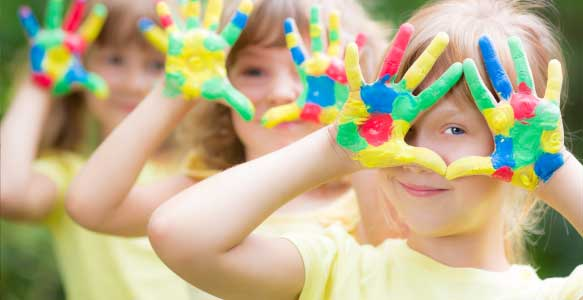 </h1> Під час занять діти оволодівають різноманітними стилями, техніками і технологіями, вчаться використовувати різноманітні матеріали та інструменти, опановують нові не лише таємничі ремесла, а й знаходять нові оригінальні поєднання національних традицій з сучасним пластичним рішенням образу, що відповідає естетиці наших днів.
Свої вміння і навички вихованці демонструють на міських, обласних та Всеукраїнських виставках – конкурсах.
Якщо діти хочуть відчути магію творчості, їм необхідно пізнавати свій власний світ і творити інтуїтивно згідно із природним сприйняттям.
Малювання – це захопливий світ яскравих, дивовижних образів.
Створені дітьми малюнки вражають дорослих своєю безпосередністю, оригінальністю, бурхливістю фантазії. Особливий інтерес викликають нетрадиційні техніки малювання. Адже процес творчості зовсім не складний, а результат його завжди позитивний незалежно від здібностей та обдарувань дитини.
Діти люблять малювати й із захопленням зображують усе, що їх оточує, що вони бачать, чують і відчувають. Дослідження вчених свідчать, що кожна людина - творець.
Але зазвичай її творчі здібності перебувають у прихованому стані й реалізуються лише за сприятливих умов. Діти та уява завжди крокують разом . Саме уява призводить до великих відкриттів та інновацій. Саме уява допомагає людям створювати красу у світі. Тож, залучаючи дітей до малювання, можна «розбудити» вроджені задатки й розвинути творчі здібності.
<a href="#top">Вверх &uarr;</a>
</li>

  </li><h1>
Юні флористи
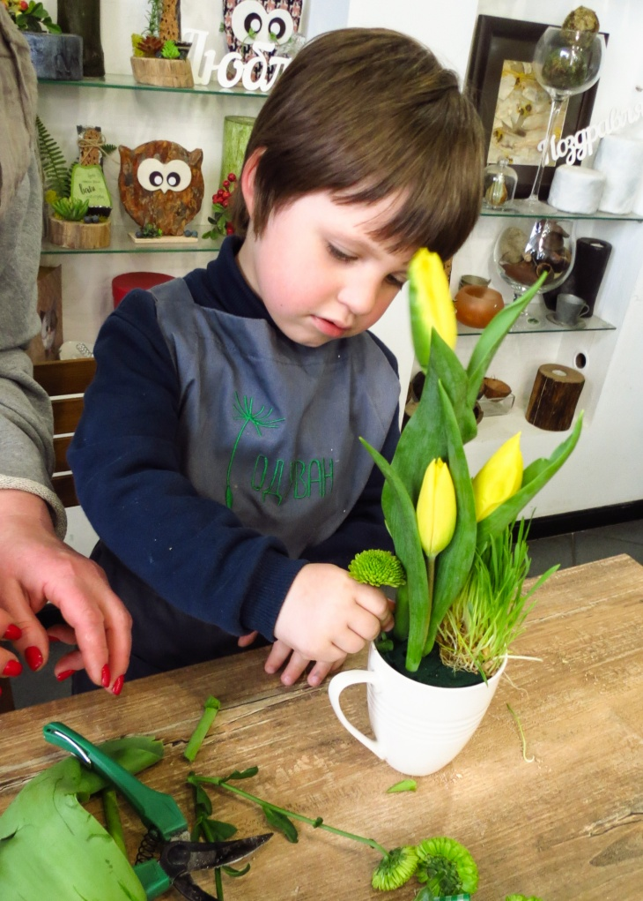 </h1> Флорист — професія дизайнера - декоратора, що оформляє приміщення з допомогою живих чи засушених квітів та рослин. Також створює квіткові композиції до різноманітних свят. Флорист-професіонал повинен бути знайомий з основами декору та кольористики.
<a href="#top">Вверх &uarr;</a>
</li>
    
  </li><h1>
Геометричне моделювання
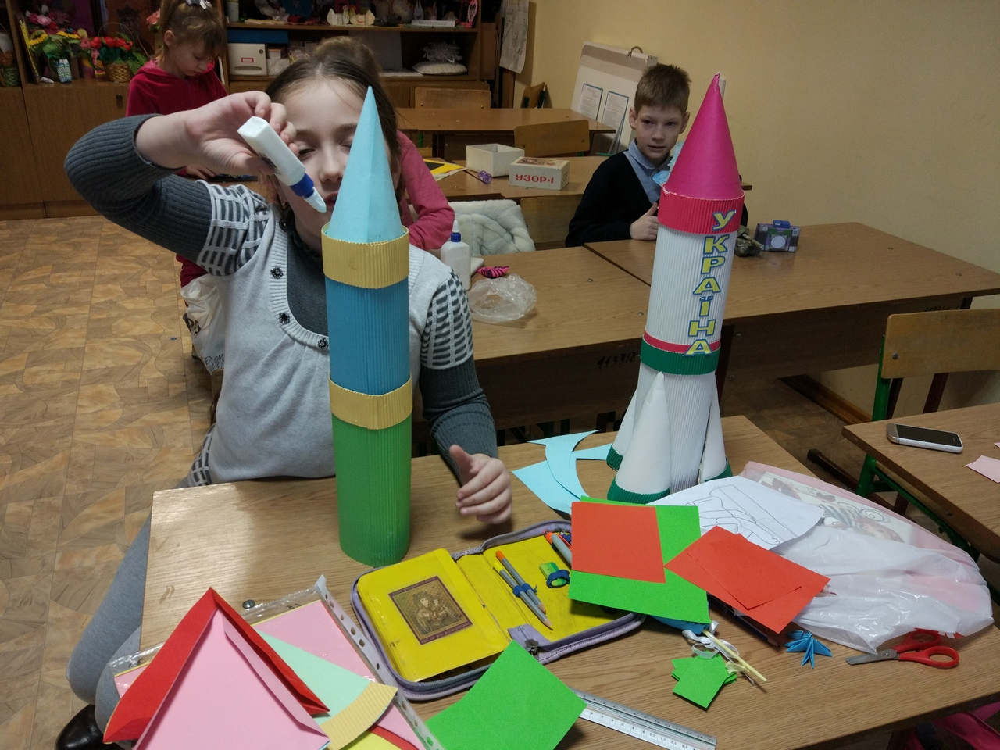 </h1> Метою гуртка «Геометричне моделювання» є розвиток творчих здібностей гуртківців шляхом навчання засобами геометричного моделювання.
Відвідуючи заняття гуртка діти ознайомлюються з різними техніками
обробки паперу, найпростішими технологічними процесами, графічною грамотністю. Геометричне моделювання – це конструювання об’ємних та напівоб’ємних форм із паперу шляхом його механічної обробки, а саме: складання, скручування, згинання, вирізування, прорізування, гофрування, зминання, склеювання, сплітання тощо. На заняттях гуртка, діти навчаються розрізняти та аналізувати характерні особливості об’ємних форм; формують основи просторового мислення; стимулюють розвиток допитливості, фантазії, розвивають дрібну моторику рук, виховують акуратність та старанність, допомагають виробити естетичний смак та інтерес до звичаїв і традицій свого народу.
<a href="#top">Вверх &uarr;</a>
</li>
    
  </li><h1>
Гурток з робототехніки "Лего"
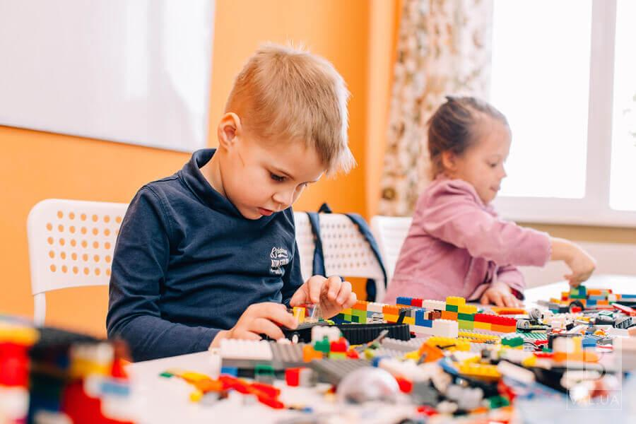 </h1> На базі Христинівського БДЮТ працює гурток «LEGO». Гурток працює для різних вікових категорій дітей від 7 років до 17 років. Заняття проводять кожної суботи за розкладом:
Молодша група – 10.15-11.55.
Старша група – 12.15-13.55.
Гуртківці молодшої групи працюють із навчальними наборами LEGO “Наука та технології”, “Пневматика”, “Світ енергії”.
В основу змісту програми з робототехніки покладено концепцію “Навчання через дію”, розроблену інститутом ЛЕГО Ед’юкейшн (Біллунд, Данія). Навчання через дію відбувається тоді, коли дитина створює реальні речі в матеріальному світі і одночасно набуває знань. Програма розрахована на використання конструкторів фірми ЛЕГО. Програма підготовлена за принципом доступності навчального матеріалу та відповідності його обсягу віковим особливостям і рівню попередньої підготовки учнів з урахуванням Державного стандарту базової та повної загальної середньої освіти з освітніх галузей “Технології”, “Математика”, “Природознавство”, “Фізика” “Інформатика”.
Для ефективної роботи секції гуртківці окрім навчальних наборів LEGO “Наука та технології”, “Пневматика”, “Світ енергії” використовують також спеціальні зошити для дітей « «Наука і технології. LEGO Education».
Гуртківці старшої групи працюють із навчальними наборами LEGO Mindstorms Education EV3.
Основною формою проведення занять є практичні роботи з програмування. При цьому робота за комп’ютером зводиться до мінімуму через додаткові витрати часу на перевірку та корекцію результату експериментальним шляхом та проведення математичних розрахунків. Крім того, курс передбачає виконання творчих робіт, основною метою яких є самостійний пошук оптимальних рішень поставлених перед слухачами задач та програмних реалізацій їх алгоритмів.
Поряд з груповими, колективними формами роботи проводиться індивідуальна робота з учнями, в тому числі при підготовці до змагань та інших масових заходів.
Протягом роботи гуртка діти взяли участь у багатьох конкурсах у м. Черкаси, м.Київ, м.Дніпро, де отримали численні перемоги.
Здобуті досягнення сприяли підвищенню рівня зацікавленості дітьми робототехнікою. Робота гуртка LEGO стала ще інтенсивнішою, з’явилися нові ідеї, все більше дітей підключилися до командної роботи.

<a href="#top">Вверх &uarr;</a>
</li>         
     
   </li><h1>
Англійська мова - крок за кроком
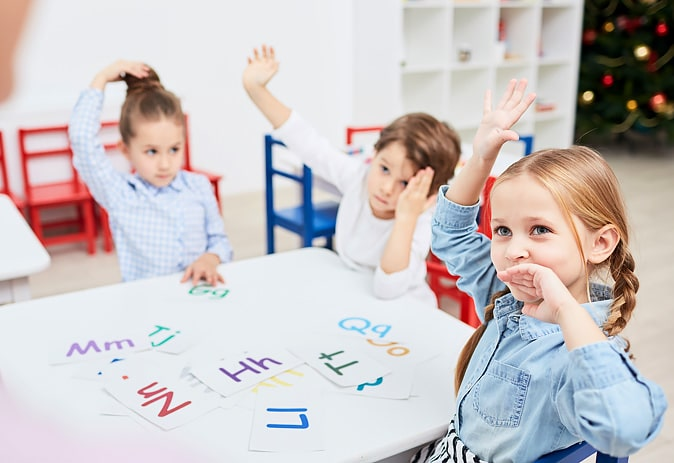 </h1> Починати вчити іноземну мову в дитинстві набагато легше: дитина здатна більше запам'ятовувати та краще сприймати. У молодшому віці іноземна мова засвоюється завдяки тим самим механізмам, що й рідна. Діти особливо сприйнятливі до фонетики та інтонації мови. Можливість вивчення іноземної мови в ранньому віці сприяє кращій вимові, а також почуттю мови та культури.

У роботі використовуються авторські методики, які допомагають зробити навчання особливо цікавим для дітей. Ігровий підхід та унікальна комунікативна методика сприяють невимушеній обстановці, більшої залученості із боку учнів і, як наслідок, підвищення ефективності засвоєння матеріалу.
НАШІ ПЕРЕВАГИ:
підтримка інтересу до вивчення англійської мови;
розвиток усіх мовних аспектів;
розширення знань про навколишній світ;
розкриття творчого потенціалу дітей у безпечній, довірчій атмосфері;
методичні матеріали, що зарекомендували себе.</li>

<a href="#top">Вверх &uarr;</a>

  </ul>
    </section>
    <footer>
          Завітайте до нас і ви обов'язково знайдете те, що шукали.
          <footer>
    <h2>Контактна інформація</h2>
    
БДЮТ-Будинок дитячою та юнацької творчості

    
Наша адреса: вулиця Першотравнева, 54, Христинівка, Черкаська область, Україна

    
Наш телефон: +38 (04745) 2-22-19 

    
Наш email: bdyth@ukr.net

</footer>
        
© 2024 Будинок дитячої та юнацької творчості

    </footer>
    
</body>
</html>
